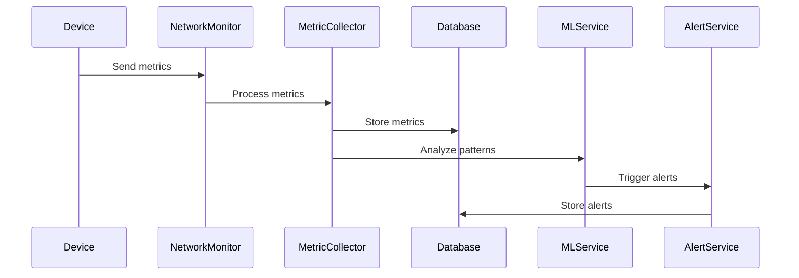
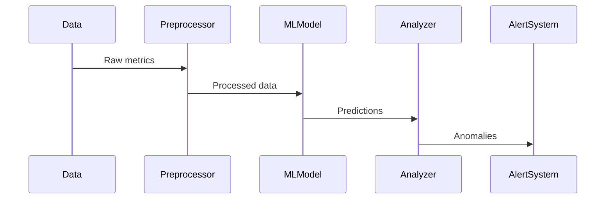

# EyeNet System Architecture Documentation

## Table of Contents
1. [Overview](#overview)
2. [System Components](#system-components)
3. [Technology Stack](#technology-stack)
4. [Data Flow](#data-flow)
5. [Scalability & Performance](#scalability--performance)
6. [Security Architecture](#security-architecture)

## Overview
EyeNet is a comprehensive network monitoring and analysis platform that combines real-time monitoring, ML-based analysis, and automated response capabilities. The system is designed to provide enterprise-grade network visibility, predictive maintenance, and intelligent alerting.

## System Components

### 1. Core Services
- **API Gateway**
  - Entry point for all client requests
  - Request routing and load balancing
  - Rate limiting and throttling
  - API versioning

- **Authentication Service**
  - JWT-based authentication
  - OAuth integration
  - Session management
  - Role-based access control (RBAC)

- **Network Monitor Service**
  - Real-time device discovery
  - Network topology mapping
  - Performance metrics collection
  - Health monitoring

- **ML Service**
  - Anomaly detection
  - Predictive maintenance
  - Traffic pattern analysis
  - Model training and deployment

- **Alert Service**
  - Alert generation and management
  - Notification dispatch
  - Alert correlation
  - Escalation handling

### 2. Supporting Services
- **Device Manager**
  - Device inventory
  - Configuration management
  - Firmware updates
  - Device health tracking

- **Metric Collector**
  - Performance data collection
  - Metric aggregation
  - Data preprocessing
  - Time-series management

- **WebSocket Service**
  - Real-time updates
  - Bi-directional communication
  - Connection management
  - Event broadcasting

## Technology Stack

### Backend
- **Runtime**: Node.js 20.x
- **Framework**: Express.js
- **Database**: 
  - MongoDB (Primary data store)
  - Redis (Caching & real-time data)
- **Message Queue**: Redis Pub/Sub
- **WebSocket**: Socket.IO
- **ML Framework**: TensorFlow.js

### Infrastructure
- **Containerization**: Docker
- **Orchestration**: Docker Compose
- **Caching**: Redis
- **Load Balancing**: Nginx
- **Monitoring**: Prometheus & Grafana

## Data Flow

### 1. Network Monitoring Flow

### 2. ML Analysis Flow

## Scalability & Performance

### Horizontal Scaling
- Stateless service design
- Redis-based session management
- Load balancer configuration
- Container orchestration

### Performance Optimization
- Multi-level caching strategy
- Database indexing
- Query optimization
- Batch processing

### Resource Management
- Connection pooling
- Memory management
- CPU utilization monitoring
- I/O optimization

## Security Architecture

### Authentication & Authorization
- JWT token validation
- Role-based access control
- API key management
- OAuth2 integration

### Network Security
- TLS/SSL encryption
- WebSocket security
- Rate limiting
- DDoS protection

### Data Security
- Encryption at rest
- Secure data transmission
- Access logging
- Audit trails
