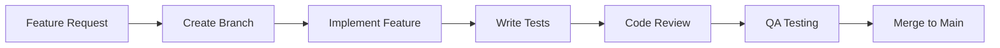

# EyeNet Development Guidelines

## Table of Contents
1. [Code Standards](#code-standards)
2. [Development Workflow](#development-workflow)
3. [Best Practices](#best-practices)
4. [Version Control](#version-control)
5. [Code Review Process](#code-review-process)
6. [Documentation Standards](#documentation-standards)

## Code Standards

### JavaScript/Node.js Standards

#### 1. Project Structure
```
src/
├── config/          # Configuration files
├── controllers/     # Request handlers
├── middleware/      # Custom middleware
├── models/          # Database models
├── routes/          # API routes
├── services/        # Business logic
├── utils/           # Helper functions
└── validation/      # Input validation schemas
```

#### 2. Naming Conventions
```javascript
// Classes - PascalCase
class NetworkDevice {
    constructor() { }
}

// Functions/Variables - camelCase
const calculateMetrics = () => { }
let deviceStatus = 'active';

// Constants - UPPER_SNAKE_CASE
const MAX_RETRY_ATTEMPTS = 3;

// File names - kebab-case
network-monitor.service.js
auth-middleware.js
```

#### 3. Code Formatting
```javascript
// Use ES6+ features
const { deviceId, metrics } = req.body;
const devices = await Device.find({ status: 'active' });

// Async/Await pattern
async function processMetrics(deviceId) {
    try {
        const device = await Device.findById(deviceId);
        return device;
    } catch (error) {
        logger.error('Error processing metrics:', error);
        throw error;
    }
}

// Promise chaining (when necessary)
return Device.findById(deviceId)
    .then(device => device.updateMetrics(metrics))
    .catch(error => handleError(error));
```

### Error Handling
```javascript
// Custom error classes
class ValidationError extends Error {
    constructor(message) {
        super(message);
        this.name = 'ValidationError';
        this.status = 400;
    }
}

// Error handling middleware
const errorHandler = (err, req, res, next) => {
    logger.error(err);
    
    if (err instanceof ValidationError) {
        return res.status(err.status).json({
            error: {
                type: err.name,
                message: err.message
            }
        });
    }
    
    res.status(500).json({
        error: {
            type: 'InternalServerError',
            message: 'An unexpected error occurred'
        }
    });
};
```

## Development Workflow

### 1. Feature Development Process


### 2. Branch Naming Convention
```
feature/   # New features
bugfix/    # Bug fixes
hotfix/    # Critical fixes
release/   # Release branches
docs/      # Documentation updates
```

### 3. Commit Message Format
```
<type>(<scope>): <subject>

<body>

<footer>

Types:
- feat: New feature
- fix: Bug fix
- docs: Documentation
- style: Formatting
- refactor: Code restructuring
- test: Adding tests
- chore: Maintenance

Example:
feat(auth): implement JWT refresh token

- Add refresh token generation
- Implement token rotation
- Add token blacklisting

Closes #123
```

## Best Practices

### 1. API Design
```javascript
// Use consistent response format
{
    "success": true,
    "data": {},
    "meta": {
        "timestamp": "2025-01-07T04:56:47+08:00",
        "version": "1.0.0"
    }
}

// Use proper HTTP methods
GET    /api/devices          // List devices
POST   /api/devices          // Create device
GET    /api/devices/:id      // Get device
PUT    /api/devices/:id      // Update device
DELETE /api/devices/:id      // Delete device
```

### 2. Security Practices
```javascript
// Input validation
const validateDevice = [
    body('name').trim().notEmpty(),
    body('type').isIn(['router', 'switch', 'access_point']),
    body('location').isObject(),
    body('metrics').optional().isObject()
];

// Rate limiting
const rateLimiter = rateLimit({
    windowMs: 15 * 60 * 1000,
    max: 100,
    message: 'Too many requests'
});

// Security headers
app.use(helmet());
app.use(cors());
app.use(xss());
```

### 3. Performance Optimization
```javascript
// Use caching
const deviceCache = new NodeCache({ stdTTL: 600 });

async function getDevice(id) {
    let device = deviceCache.get(id);
    if (!device) {
        device = await Device.findById(id);
        deviceCache.set(id, device);
    }
    return device;
}

// Database indexing
deviceSchema.index({ name: 1, status: 1 });
deviceSchema.index({ 'location.building': 1 });

// Query optimization
const devices = await Device.find()
    .select('name status metrics')
    .lean()
    .limit(10);
```

## Version Control

### 1. Git Workflow
```bash
# Feature development
git checkout -b feature/new-feature
git add .
git commit -m "feat: implement new feature"
git push origin feature/new-feature

# Code review
git fetch origin
git rebase origin/main
git push -f origin feature/new-feature

# Merge
git checkout main
git merge --no-ff feature/new-feature
git push origin main
```

### 2. Release Process
```bash
# Create release branch
git checkout -b release/1.2.0

# Version bump
npm version minor

# Create tag
git tag -a v1.2.0 -m "Release 1.2.0"
git push origin v1.2.0
```

## Code Review Process

### 1. Review Checklist
- [ ] Code follows style guide
- [ ] Tests are included and passing
- [ ] Documentation is updated
- [ ] No security vulnerabilities
- [ ] Performance impact considered
- [ ] Error handling is appropriate
- [ ] Logging is adequate

### 2. Pull Request Template
```markdown
## Description
[Description of changes]

## Type of Change
- [ ] Bug fix
- [ ] New feature
- [ ] Breaking change
- [ ] Documentation update

## Testing
- [ ] Unit tests
- [ ] Integration tests
- [ ] Manual testing

## Screenshots
[If applicable]

## Checklist
- [ ] Code follows style guide
- [ ] Tests added/updated
- [ ] Documentation updated
- [ ] Reviewed by team member
```

## Documentation Standards

### 1. Code Documentation
```javascript
/**
 * Process device metrics and generate alerts if necessary
 * @param {string} deviceId - The ID of the device
 * @param {Object} metrics - Device metrics
 * @param {number} metrics.cpu - CPU usage percentage
 * @param {number} metrics.memory - Memory usage percentage
 * @returns {Promise<Object>} Processed metrics with alert status
 * @throws {ValidationError} If metrics are invalid
 */
async function processMetrics(deviceId, metrics) {
    // Implementation
}
```

### 2. API Documentation
```javascript
/**
 * @api {post} /api/devices Create Device
 * @apiName CreateDevice
 * @apiGroup Devices
 * @apiVersion 1.0.0
 *
 * @apiParam {String} name Device name
 * @apiParam {String} type Device type
 * @apiParam {Object} location Device location
 *
 * @apiSuccess {String} id Device ID
 * @apiSuccess {String} name Device name
 * @apiSuccess {String} status Device status
 *
 * @apiError {Object} error Error object
 * @apiError {String} error.message Error message
 */
```

### 3. README Template
```markdown
# Component Name

## Overview
Brief description of the component

## Features
- Feature 1
- Feature 2

## Installation
Installation instructions

## Usage
Usage examples

## API
API documentation

## Contributing
Contribution guidelines

## License
License information
```
