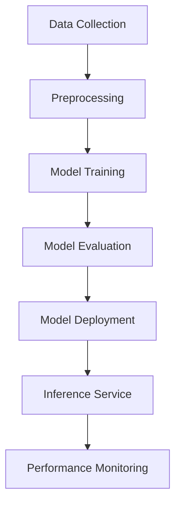

# EyeNet ML System Architecture

## Table of Contents
1. [Overview](#overview)
2. [ML Pipeline](#ml-pipeline)
3. [Model Architecture](#model-architecture)
4. [Training Process](#training-process)
5. [Inference System](#inference-system)
6. [Performance Monitoring](#performance-monitoring)

## Overview

### System Architecture


### Key Components
- Data Collection System
- Feature Engineering Pipeline
- Model Training Infrastructure
- Model Serving System
- Performance Monitoring
- Automated Retraining Pipeline

## ML Pipeline

### 1. Data Collection
```javascript
// DataCollector.js
class DataCollector {
    constructor() {
        this.metrics = {
            cpu: [],
            memory: [],
            network: [],
            temperature: []
        };
        this.samplingRate = 60; // seconds
    }

    async collectMetrics(deviceId) {
        const device = await Device.findById(deviceId);
        const metrics = await device.getMetrics();
        
        // Store metrics with timestamps
        this.metrics.cpu.push({
            value: metrics.cpu,
            timestamp: new Date(),
            deviceId
        });
        
        // Process and store other metrics...
    }

    async exportTrainingData() {
        return {
            features: this.preprocessMetrics(),
            labels: this.generateLabels()
        };
    }
}
```

### 2. Feature Engineering
```javascript
// FeatureEngineering.js
class FeatureProcessor {
    constructor() {
        this.scalers = {
            cpu: new MinMaxScaler(),
            memory: new MinMaxScaler(),
            network: new StandardScaler()
        };
    }

    async processFeatures(data) {
        // Time-based features
        const timeFeatures = this.extractTimeFeatures(data);
        
        // Statistical features
        const statFeatures = this.calculateStatistics(data);
        
        // Trend features
        const trendFeatures = this.extractTrends(data);
        
        return {
            ...timeFeatures,
            ...statFeatures,
            ...trendFeatures
        };
    }

    extractTimeFeatures(data) {
        return {
            hourOfDay: data.timestamp.getHours(),
            dayOfWeek: data.timestamp.getDay(),
            isWeekend: [0, 6].includes(data.timestamp.getDay())
        };
    }

    calculateStatistics(data) {
        return {
            mean: calculateMean(data.values),
            std: calculateStd(data.values),
            min: Math.min(...data.values),
            max: Math.max(...data.values)
        };
    }
}
```

## Model Architecture

### 1. Anomaly Detection Model
```python
# anomaly_model.py
class AnomalyDetector:
    def __init__(self):
        self.model = Sequential([
            LSTM(64, input_shape=(sequence_length, n_features)),
            Dense(32, activation='relu'),
            Dense(n_features, activation='sigmoid')
        ])
        
        self.threshold = self.calculate_threshold()
    
    def calculate_threshold(self):
        reconstructions = self.model.predict(validation_data)
        mse = np.mean(np.power(validation_data - reconstructions, 2), axis=1)
        return np.percentile(mse, 95)
    
    def detect_anomalies(self, data):
        reconstructions = self.model.predict(data)
        mse = np.mean(np.power(data - reconstructions, 2), axis=1)
        return mse > self.threshold

```

### 2. Prediction Model
```python
# prediction_model.py
class NetworkPredictor:
    def __init__(self):
        self.model = Sequential([
            LSTM(128, return_sequences=True),
            Dropout(0.2),
            LSTM(64),
            Dense(32, activation='relu'),
            Dense(1)
        ])
    
    def train(self, X_train, y_train, epochs=100):
        self.model.compile(
            optimizer='adam',
            loss='mse',
            metrics=['mae']
        )
        
        return self.model.fit(
            X_train, y_train,
            validation_split=0.2,
            epochs=epochs,
            callbacks=[
                EarlyStopping(patience=10),
                ModelCheckpoint('best_model.h5')
            ]
        )
```

## Training Process

### 1. Training Pipeline
```javascript
// TrainingPipeline.js
class TrainingPipeline {
    constructor() {
        this.dataCollector = new DataCollector();
        this.featureProcessor = new FeatureProcessor();
        this.modelTrainer = new ModelTrainer();
    }

    async trainModel() {
        // Collect training data
        const rawData = await this.dataCollector.exportTrainingData();
        
        // Process features
        const processedData = await this.featureProcessor.processFeatures(rawData);
        
        // Split data
        const {
            trainData,
            validData,
            testData
        } = this.splitData(processedData);
        
        // Train model
        const model = await this.modelTrainer.train(trainData, validData);
        
        // Evaluate model
        const metrics = await this.evaluateModel(model, testData);
        
        // Save model
        await this.saveModel(model, metrics);
    }

    splitData(data) {
        // Implementation of train/valid/test split
    }

    async evaluateModel(model, testData) {
        // Model evaluation logic
    }
}
```

### 2. Model Versioning
```javascript
// ModelVersion.js
class ModelVersionManager {
    constructor() {
        this.modelRegistry = new ModelRegistry();
    }

    async saveModel(model, metadata) {
        const version = await this.generateVersion();
        
        await this.modelRegistry.save({
            version,
            model,
            metadata: {
                ...metadata,
                timestamp: new Date(),
                metrics: await this.evaluateModel(model)
            }
        });
    }

    async loadModel(version) {
        return this.modelRegistry.load(version);
    }

    async listVersions() {
        return this.modelRegistry.list();
    }
}
```

## Inference System

### 1. Model Serving
```javascript
// ModelServer.js
class ModelServer {
    constructor() {
        this.models = new Map();
        this.versionManager = new ModelVersionManager();
    }

    async loadModel(version) {
        if (!this.models.has(version)) {
            const model = await this.versionManager.loadModel(version);
            this.models.set(version, model);
        }
        return this.models.get(version);
    }

    async predict(data, version = 'latest') {
        const model = await this.loadModel(version);
        const processedData = await this.preprocessInput(data);
        return model.predict(processedData);
    }

    async batchPredict(dataArray) {
        const batchSize = 32;
        const predictions = [];
        
        for (let i = 0; i < dataArray.length; i += batchSize) {
            const batch = dataArray.slice(i, i + batchSize);
            const batchPredictions = await this.predict(batch);
            predictions.push(...batchPredictions);
        }
        
        return predictions;
    }
}
```

### 2. Prediction Cache
```javascript
// PredictionCache.js
class PredictionCache {
    constructor() {
        this.cache = new NodeCache({
            stdTTL: 300, // 5 minutes
            checkperiod: 60
        });
    }

    generateKey(data, version) {
        return `pred_${hash(data)}_${version}`;
    }

    async getPrediction(data, version) {
        const key = this.generateKey(data, version);
        return this.cache.get(key);
    }

    async setPrediction(data, version, prediction) {
        const key = this.generateKey(data, version);
        this.cache.set(key, prediction);
    }
}
```

## Performance Monitoring

### 1. Metric Collection
```javascript
// ModelMetrics.js
class ModelMetricsCollector {
    constructor() {
        this.metrics = {
            predictions: 0,
            errors: 0,
            latency: [],
            accuracy: []
        };
    }

    async trackPrediction(startTime, prediction, actual) {
        // Track latency
        const latency = Date.now() - startTime;
        this.metrics.latency.push(latency);
        
        // Track accuracy
        if (actual !== undefined) {
            const accuracy = calculateAccuracy(prediction, actual);
            this.metrics.accuracy.push(accuracy);
        }
        
        // Track counts
        this.metrics.predictions++;
    }

    async trackError(error) {
        this.metrics.errors++;
        logger.error('Prediction error:', error);
    }

    getMetricsSummary() {
        return {
            totalPredictions: this.metrics.predictions,
            errorRate: this.metrics.errors / this.metrics.predictions,
            averageLatency: mean(this.metrics.latency),
            accuracyMetrics: {
                mean: mean(this.metrics.accuracy),
                std: std(this.metrics.accuracy)
            }
        };
    }
}
```

### 2. Performance Alerts
```javascript
// ModelMonitor.js
class ModelMonitor {
    constructor() {
        this.metricsCollector = new ModelMetricsCollector();
        this.alertThresholds = {
            errorRate: 0.05,
            latency: 500,
            accuracy: 0.95
        };
    }

    async checkPerformance() {
        const metrics = this.metricsCollector.getMetricsSummary();
        
        // Check error rate
        if (metrics.errorRate > this.alertThresholds.errorRate) {
            await this.triggerAlert('High error rate detected');
        }
        
        // Check latency
        if (metrics.averageLatency > this.alertThresholds.latency) {
            await this.triggerAlert('High latency detected');
        }
        
        // Check accuracy
        if (metrics.accuracyMetrics.mean < this.alertThresholds.accuracy) {
            await this.triggerAlert('Low accuracy detected');
        }
    }

    async triggerAlert(message) {
        await AlertService.create({
            type: 'model_performance',
            message,
            severity: 'high',
            metadata: this.metricsCollector.getMetricsSummary()
        });
    }
}
```
