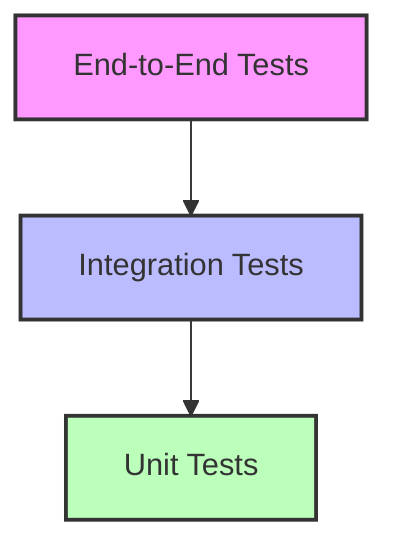

# EyeNet Testing Procedures

## Table of Contents
1. [Testing Strategy](#testing-strategy)
2. [Unit Testing](#unit-testing)
3. [Integration Testing](#integration-testing)
4. [Performance Testing](#performance-testing)
5. [Security Testing](#security-testing)
6. [End-to-End Testing](#end-to-end-testing)
7. [CI/CD Pipeline](#cicd-pipeline)

## Testing Strategy

### Test Pyramid


### Test Coverage Goals
- Unit Tests: 80%+ coverage
- Integration Tests: 60%+ coverage
- End-to-End Tests: Critical path coverage

## Unit Testing

### 1. Test Structure
```javascript
// device.test.js
describe('Device Service', () => {
    describe('createDevice', () => {
        it('should create a new device with valid data', async () => {
            const deviceData = {
                name: 'Test Router',
                type: 'router',
                location: {
                    building: 'HQ',
                    floor: '1'
                }
            };
            
            const device = await DeviceService.createDevice(deviceData);
            
            expect(device).toHaveProperty('_id');
            expect(device.name).toBe(deviceData.name);
        });
        
        it('should throw error with invalid data', async () => {
            const invalidData = {
                name: '',
                type: 'invalid'
            };
            
            await expect(
                DeviceService.createDevice(invalidData)
            ).rejects.toThrow(ValidationError);
        });
    });
});
```

### 2. Mocking
```javascript
// Mock database calls
jest.mock('../models/Device', () => ({
    create: jest.fn(),
    findById: jest.fn(),
    updateOne: jest.fn()
}));

// Mock external services
jest.mock('../services/AlertService', () => ({
    createAlert: jest.fn()
}));

// Mock time
jest.useFakeTimers();
```

### 3. Test Helpers
```javascript
// testUtils.js
export const createMockDevice = (overrides = {}) => ({
    _id: 'device123',
    name: 'Test Device',
    type: 'router',
    status: 'active',
    ...overrides
});

export const createMockMetrics = (overrides = {}) => ({
    cpu: 50,
    memory: 60,
    temperature: 35,
    ...overrides
});
```

## Integration Testing

### 1. API Tests
```javascript
// device.integration.test.js
describe('Device API', () => {
    let app;
    let token;
    
    beforeAll(async () => {
        app = await createTestApp();
        token = await generateTestToken();
    });
    
    describe('POST /api/devices', () => {
        it('should create new device', async () => {
            const response = await request(app)
                .post('/api/devices')
                .set('Authorization', `Bearer ${token}`)
                .send({
                    name: 'Integration Test Device',
                    type: 'switch'
                });
                
            expect(response.status).toBe(201);
            expect(response.body).toHaveProperty('data.name');
        });
    });
});
```

### 2. Database Integration
```javascript
// database.integration.test.js
describe('Database Integration', () => {
    beforeAll(async () => {
        await mongoose.connect(process.env.TEST_MONGODB_URI);
    });
    
    afterAll(async () => {
        await mongoose.disconnect();
    });
    
    it('should perform CRUD operations', async () => {
        // Create
        const device = await Device.create({
            name: 'Test Device',
            type: 'router'
        });
        
        // Read
        const found = await Device.findById(device._id);
        expect(found.name).toBe(device.name);
        
        // Update
        await Device.updateOne(
            { _id: device._id },
            { status: 'inactive' }
        );
        
        // Delete
        await Device.deleteOne({ _id: device._id });
    });
});
```

## Performance Testing

### 1. Load Testing
```javascript
// loadtest.js
import { check } from 'k6';
import http from 'k6/http';

export const options = {
    stages: [
        { duration: '1m', target: 50 },  // Ramp up
        { duration: '3m', target: 50 },  // Stay at 50 users
        { duration: '1m', target: 0 }    // Ramp down
    ],
    thresholds: {
        http_req_duration: ['p(95)<500']  // 95% of requests should be below 500ms
    }
};

export default function() {
    const response = http.get('http://localhost:5000/api/devices');
    check(response, {
        'is status 200': (r) => r.status === 200,
        'response time < 500ms': (r) => r.timings.duration < 500
    });
}
```

### 2. Stress Testing
```javascript
// stress.test.js
describe('Stress Test', () => {
    it('should handle multiple concurrent requests', async () => {
        const concurrentRequests = 100;
        const requests = Array(concurrentRequests).fill().map(() =>
            DeviceService.getMetrics('device123')
        );
        
        const results = await Promise.all(requests);
        expect(results).toHaveLength(concurrentRequests);
    });
});
```

## Security Testing

### 1. Authentication Tests
```javascript
describe('Authentication', () => {
    it('should reject invalid tokens', async () => {
        const response = await request(app)
            .get('/api/devices')
            .set('Authorization', 'Bearer invalid-token');
            
        expect(response.status).toBe(401);
    });
    
    it('should prevent token replay', async () => {
        const token = await generateExpiredToken();
        const response = await request(app)
            .get('/api/devices')
            .set('Authorization', `Bearer ${token}`);
            
        expect(response.status).toBe(401);
    });
});
```

### 2. Authorization Tests
```javascript
describe('Authorization', () => {
    it('should enforce role-based access', async () => {
        const userToken = await generateUserToken();
        const adminToken = await generateAdminToken();
        
        // User access
        const userResponse = await request(app)
            .post('/api/admin/config')
            .set('Authorization', `Bearer ${userToken}`)
            .send({ setting: 'value' });
            
        expect(userResponse.status).toBe(403);
        
        // Admin access
        const adminResponse = await request(app)
            .post('/api/admin/config')
            .set('Authorization', `Bearer ${adminToken}`)
            .send({ setting: 'value' });
            
        expect(adminResponse.status).toBe(200);
    });
});
```

## End-to-End Testing

### 1. UI Tests
```javascript
// device.e2e.test.js
describe('Device Management', () => {
    beforeEach(async () => {
        await page.goto('http://localhost:3000/devices');
    });
    
    it('should create new device', async () => {
        await page.click('#add-device-btn');
        await page.fill('#device-name', 'E2E Test Device');
        await page.selectOption('#device-type', 'router');
        await page.click('#save-device-btn');
        
        const toast = await page.waitForSelector('.toast-success');
        expect(await toast.textContent()).toContain('Device created');
    });
});
```

### 2. API Flow Tests
```javascript
describe('Device Lifecycle', () => {
    it('should handle complete device lifecycle', async () => {
        // Create device
        const createResponse = await request(app)
            .post('/api/devices')
            .set('Authorization', `Bearer ${token}`)
            .send(deviceData);
            
        const deviceId = createResponse.body.data._id;
        
        // Update metrics
        await request(app)
            .post(`/api/devices/${deviceId}/metrics`)
            .set('Authorization', `Bearer ${token}`)
            .send(metricsData);
            
        // Check alerts
        const alertResponse = await request(app)
            .get(`/api/devices/${deviceId}/alerts`)
            .set('Authorization', `Bearer ${token}`);
            
        // Delete device
        await request(app)
            .delete(`/api/devices/${deviceId}`)
            .set('Authorization', `Bearer ${token}`);
    });
});
```

## CI/CD Pipeline

### 1. GitHub Actions Workflow
```yaml
name: Test Pipeline

on:
  push:
    branches: [ main, develop ]
  pull_request:
    branches: [ main ]

jobs:
  test:
    runs-on: ubuntu-latest
    
    steps:
    - uses: actions/checkout@v2
    
    - name: Setup Node.js
      uses: actions/setup-node@v2
      with:
        node-version: '20'
        
    - name: Install dependencies
      run: npm ci
        
    - name: Run linter
      run: npm run lint
        
    - name: Run unit tests
      run: npm run test:unit
        
    - name: Run integration tests
      run: npm run test:integration
        
    - name: Run E2E tests
      run: npm run test:e2e
        
    - name: Upload coverage
      uses: codecov/codecov-action@v2
```

### 2. Test Reports
```javascript
// jest.config.js
module.exports = {
    reporters: [
        'default',
        ['jest-junit', {
            outputDirectory: 'reports/junit',
            outputName: 'junit.xml',
            classNameTemplate: '{classname}',
            titleTemplate: '{title}'
        }],
        ['jest-html-reporter', {
            pageTitle: 'Test Report',
            outputPath: 'reports/test-report.html',
            includeFailureMsg: true
        }]
    ],
    coverageReporters: ['text', 'lcov', 'html'],
    collectCoverageFrom: [
        'src/**/*.{js,jsx}',
        '!src/**/*.test.{js,jsx}',
        '!src/index.js'
    ]
};
```
